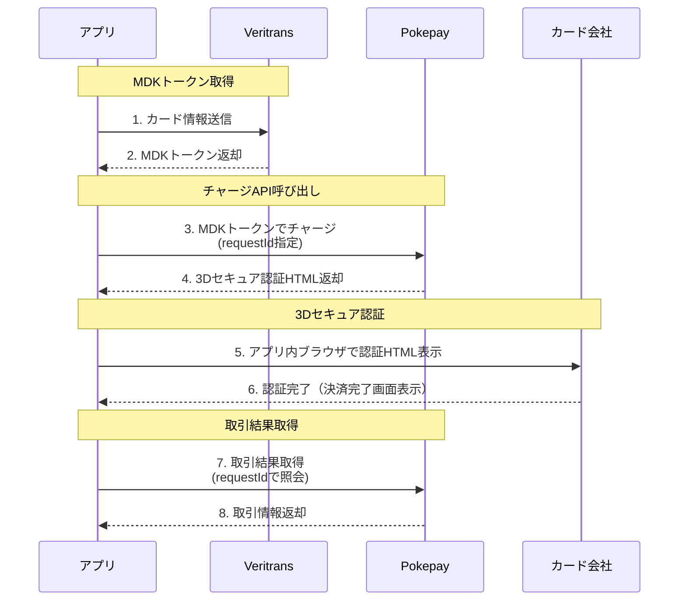

# クレジットカード組込みガイド

Pokepay iOS SDKを使用したクレジットカードチャージ機能の組込みガイドです。

## 概要

クレジットカードチャージはDGフィナンシャルテクノロジーが提供するVeriTrans4Gを利用しています。カード情報は直接Veritrans APIに送信され、MDKトークン化されます。PokepayサーバーにはMDKトークンのみが送信されるため、カード情報を安全に取り扱うことができます。

## チャージフロー



### 3Dセキュア2.0認証について

クレジットカードチャージ時には3Dセキュア2.0（本人認証サービス）対応のため、各カード会社の認証画面を経る必要があります。

1. `TopupWithCreditCardMdkToken` または `TopupWithCreditCardMembership` のレスポンスはHTML形式で返却されます
2. このHTMLをアプリ内ブラウザ（WKWebView等）で表示します
3. ユーザーがカード会社の認証を完了すると、ブラウザ内に決済完了画面が表示されます
4. アプリで独自の決済完了画面を表示したり後続処理を行う場合は、API呼び出し時に指定した`requestId`で取引結果を取得します

## 前提条件

- Veritrans Token API Key（Veritrans加盟店向け設定画面から取得）
- Pokepayのマネー設定でクレジットカードチャージが設定されていること
  - 以下の情報をPokepayのシステム管理者にお伝えください
    - `MERCHANT_CC_ID` : Veritransで発番される加盟店ID
    - `MERCHANT_SECRET_KEY` : Veritransで発番される加盟店用シークレットキー
    - チャージ取引のチャージ元となる店舗ユーザ

## 実装方法

### 1. カード利用可否の確認

チャージ対象のマネーがクレジットカードに対応しているか確認します。

```swift
let client = Pokepay.Client(accessToken: accessToken, env: .production)

client.getTerminalInfo() { result in
    switch result {
    case .success(let response):
        for account in response.accounts {
            if let canUseCreditCard = account.privateMoney.canUseCreditCard {
                print("\(account.privateMoney.name): \(canUseCreditCard)")
            }
        }
    case .failure(let error):
        print("Error: \(error)")
    }
}
```

### 2. Veritrans MDKトークンの取得

カード情報をVeritrans APIに送信してMDKトークンを取得します。

```swift
let veritransClient = Pokepay.VeritransClient()

let request = VeritransAPI.Token.GetVeritransToken(
    cardNumber: "4111111111111111",       // カード番号
    cardExpiryDate: "12/25",              // 有効期限 (MM/YY)
    securityCode: "123",                  // セキュリティコード
    tokenApiKey: "your-token-api-key",    // Veritrans Token API Key
    cardholderName: "TARO YAMADA"         // カード名義人
)

veritransClient.send(request) { result in
    switch result {
    case .success(let response):
        let mdkToken = response.token
        // このMDKトークンを使ってチャージまたはカード登録を行う
    case .failure(let error):
        print("Veritrans Error: \(error)")
    }
}
```

### 3A. 即時チャージ（カード登録なし）

取得したMDKトークンを使って即時チャージを行います。カード情報は保存されません。

#### チャージAPIの呼び出し

```swift
// 取引結果取得用にrequestIdを保持しておく
let requestId = UUID().uuidString

let request = BankAPI.CreditCard.TopupWithCreditCardMdkToken(
    userId: userId,
    token: mdkToken,
    accountId: accountId,
    amount: 1000,                              // チャージ金額
    organizationCode: organizationCode,
    isCardholderNameSpecified: true,           // 名義人指定の有無
    requestId: requestId,                      // 冪等性キー（取引結果取得に必要）
    topupQuotaId: nil                          // チャージ枠ID（任意）
)

client.send(request) { result in
    switch result {
    case .success(let html):
        // HTMLをアプリ内ブラウザで表示して3Dセキュア認証を行う
        self.show3DSecureWebView(html: html, requestId: requestId)
    case .failure(let error):
        print("チャージ失敗: \(error)")
    }
}
```

#### 3Dセキュア認証画面の表示

```swift
import WebKit

func show3DSecureWebView(html: String, requestId: String) {
    let webView = WKWebView(frame: view.bounds)
    webView.navigationDelegate = self
    view.addSubview(webView)

    // 認証HTMLを表示
    webView.loadHTMLString(html, baseURL: nil)

    // requestIdを保持（認証完了後の取引結果取得に使用）
    self.currentRequestId = requestId
}

// WKNavigationDelegateで認証完了を検知
func webView(_ webView: WKWebView, didFinish navigation: WKNavigation!) {
    // 決済完了画面が表示されたことを検知したら取引結果を取得
    // ※ 実装方法はアプリの要件に応じて調整してください
}
```

#### 取引結果の取得

3Dセキュア認証完了後、`requestId`を使って取引結果を取得します。

```swift
let request = BankAPI.Transaction.GetTransactionByRequestId(
    requestId: requestId
)

client.send(request) { result in
    switch result {
    case .success(let transaction):
        print("チャージ成功")
        print("取引ID: \(transaction.id)")
        print("チャージ金額: \(transaction.amount)")
        print("チャージ後残高: \(transaction.balance)")
        // アプリ独自の決済完了画面を表示
        self.showCompletionScreen(transaction: transaction)
    case .failure(let error):
        print("取引結果取得失敗: \(error)")
    }
}
```

### 3B. カード登録 → 登録カードでチャージ

#### カードの登録

```swift
let request = BankAPI.CreditCard.CreateCreditCard(
    token: mdkToken,
    isCardholderNameSpecified: true,
    organizationCode: organizationCode,
    userId: userId
)

client.send(request) { result in
    switch result {
    case .success(let creditCard):
        print("カード登録成功")
        print("カード番号: \(creditCard.cardNumber)")      // マスク済み
        print("登録日時: \(creditCard.registeredAt)")
    case .failure(let error):
        print("カード登録失敗: \(error)")
    }
}
```

#### 登録済みカード一覧の取得

```swift
let request = BankAPI.CreditCard.GetCreditCards(
    userId: userId,
    before: nil,
    after: nil,
    perPage: 20,
    organizationCode: organizationCode
)

client.send(request) { result in
    switch result {
    case .success(let response):
        for card in response.items {
            print("カード: \(card.cardNumber) (登録: \(card.registeredAt))")
        }
    case .failure(let error):
        print("取得失敗: \(error)")
    }
}
```

#### 登録済みカードでチャージ

```swift
let request = BankAPI.CreditCard.TopupWithCreditCardMembership(
    userId: userId,
    cardRegisteredAt: creditCard.registeredAt,  // または cardUuid
    cardUuid: nil,
    accountId: accountId,
    amount: 1000,
    deleteCardIfAuthFail: false,                // 認証失敗時にカード削除するか
    organizationCode: organizationCode,
    requestId: UUID().uuidString,
    topupQuotaId: nil
)

client.send(request) { result in
    switch result {
    case .success(_):
        print("チャージ成功")
    case .failure(let error):
        print("チャージ失敗: \(error)")
    }
}
```

#### カードの削除

```swift
let request = BankAPI.CreditCard.DeleteCreditCard(
    cardRegisteredAt: creditCard.registeredAt,  // または cardUuid
    cardUuid: nil,
    organizationCode: organizationCode,
    userId: userId
)

client.send(request) { result in
    switch result {
    case .success(_):
        print("カード削除成功")
    case .failure(let error):
        print("カード削除失敗: \(error)")
    }
}
```

## エラーハンドリング

### Veritrans APIエラー

```swift
case .failure(let error):
    if let veritransError = error as? VeritransAPIError {
        switch veritransError {
        case .clientError(let statusCode, let errorDetail):
            // 4xx エラー（カード情報不正など）
            print("クライアントエラー (\(statusCode)): \(errorDetail.message)")
        case .serverError(let statusCode, let errorDetail):
            // 5xx エラー（Veritransサーバーエラー）
            print("サーバーエラー (\(statusCode)): \(errorDetail.message)")
        case .invalidJSON(let parseError):
            print("JSONパースエラー: \(parseError)")
        case .unknownError(let statusCode, let errorDetail):
            print("不明なエラー: \(errorDetail.message)")
        }
    }
```

### 主なエラーコード

| コード | 説明 |
|--------|------|
| `invalid_card_number` | カード番号が不正 |
| `invalid_expiry_date` | 有効期限が不正 |
| `invalid_security_code` | セキュリティコードが不正 |
| `card_expired` | カードの有効期限切れ |
| `insufficient_funds` | 残高不足 |
| `card_declined` | カード会社による拒否 |

## APIリファレンス

### VeritransAPI.Token.GetVeritransToken

MDKトークンを取得します。カード情報をVeritrans APIに送信してトークン化します。

- **メソッド**: POST
- **パス**: `/4gtoken`
- **ベースURL**: `https://api3.veritrans.co.jp`

#### リクエスト

| パラメータ | 型 | 必須 | 説明 |
|-----------|-----|------|------|
| `cardNumber` | String | ✓ | カード番号（数字のみ、ハイフンなし） |
| `cardExpiryDate` | String | ✓ | 有効期限（MM/YY形式） |
| `securityCode` | String | ✓ | セキュリティコード（3-4桁） |
| `tokenApiKey` | String | ✓ | Veritrans Token API Key |
| `cardholderName` | String | ✓ | カード名義人（半角英字） |

#### レスポンス: `VeritransToken`

| フィールド | 型 | 説明 |
|-----------|-----|------|
| `token` | String | MDKトークン |

---

### BankAPI.CreditCard.CreateCreditCard

MDKトークンを使用してクレジットカードを登録します。

- **メソッド**: POST
- **パス**: `/users/{userId}/cards`

#### リクエスト

| パラメータ | 型 | 必須 | 説明 |
|-----------|-----|------|------|
| `token` | String | ✓ | Veritrans MDKトークン |
| `isCardholderNameSpecified` | Bool | - | カード名義人が指定されているか。MDKトークン取得時にカード名義人を送信した場合、真に設定してください |
| `organizationCode` | String | ✓ | 組織コード |
| `userId` | String | ✓ | ユーザーID |

#### レスポンス: `CreditCard`

| フィールド | 型 | 説明 |
|-----------|-----|------|
| `cardNumber` | String | マスク済みカード番号（例: `************1234`） |
| `registeredAt` | String | 登録日時（ISO8601形式） |

---

### BankAPI.CreditCard.GetCreditCards

登録済みクレジットカードの一覧を取得します。

- **メソッド**: GET
- **パス**: `/users/{userId}/cards`

#### リクエスト

| パラメータ | 型 | 必須 | 説明 |
|-----------|-----|------|------|
| `userId` | String | ✓ | ユーザーID |
| `before` | String | - | ページネーション: カード登録日時(registerdAt)を指定。これ以前のデータを取得 |
| `after` | String | - | ページネーション: カード登録日時(registerdAt)を指定。これ以降のデータを取得 |
| `perPage` | Int | - | 1ページあたりの件数（デフォルト: 20） |
| `organizationCode` | String | ✓ | 組織コード |

#### レスポンス: `PaginatedCreditCards`

| フィールド | 型 | 説明 |
|-----------|-----|------|
| `perPage` | Int | 1ページあたりの件数 |
| `count` | Int | 全件数 |
| `next` | String? | 次ページのカーソル |
| `prev` | String? | 前ページのカーソル |
| `items` | [CreditCard] | クレジットカードの配列 |

---

### BankAPI.CreditCard.DeleteCreditCard

登録済みクレジットカードを削除します。

- **メソッド**: POST
- **パス**: `/users/{userId}/cards/delete`

#### リクエスト

| パラメータ | 型 | 必須 | 説明 |
|-----------|-----|------|------|
| `cardRegisteredAt` | String | △ | カード登録日時（`cardUuid`と択一） |
| `cardUuid` | String | △ | カードUUID（`cardRegisteredAt`と択一） |
| `organizationCode` | String | ✓ | 組織コード |
| `userId` | String | ✓ | ユーザーID |

#### レスポンス: `NoContent`

レスポンスボディはありません（HTTPステータス204）。

---

### BankAPI.CreditCard.TopupWithCreditCardMdkToken

MDKトークンを使用して即時チャージを行います。カード情報は保存されません。

- **メソッド**: POST
- **パス**: `/veritrans/card-authorize/topup-with-mdk-token`

#### リクエスト

| パラメータ | 型 | 必須 | 説明 |
|-----------|-----|------|------|
| `userId` | String | ✓ | ユーザーID |
| `token` | String | ✓ | Veritrans MDKトークン |
| `accountId` | String | ✓ | チャージ先アカウントID |
| `amount` | Int | ✓ | チャージ金額（円） |
| `organizationCode` | String | ✓ | 組織コード |
| `isCardholderNameSpecified` | Bool | - | カード名義人が指定されているか |
| `requestId` | String | - | 冪等性キー（重複リクエスト防止用）、UUIDフォーマットである必要あり(UUIDv7推奨) |
| `topupQuotaId` | Int | - | チャージ枠ID |

#### レスポンス: `String`

チャージ成功時のレスポンス（HTML形式）。3Dセキュア認証画面を含むHTMLが返却されます。

---

### BankAPI.CreditCard.TopupWithCreditCardMembership

登録済みクレジットカードを使用してチャージを行います。

- **メソッド**: POST
- **パス**: `/veritrans/card-authorize/topup-with-membership`

#### リクエスト

| パラメータ | 型 | 必須 | 説明 |
|-----------|-----|------|------|
| `userId` | String | ✓ | ユーザーID |
| `cardRegisteredAt` | String | △ | カード登録日時（`cardUuid`と択一） |
| `cardUuid` | String | △ | カードUUID（`cardRegisteredAt`と択一） |
| `accountId` | String | ✓ | チャージ先アカウントID |
| `amount` | Int | ✓ | チャージ金額（円） |
| `deleteCardIfAuthFail` | Bool | - | 認証失敗時にカードを削除するか |
| `organizationCode` | String | ✓ | 組織コード |
| `requestId` | String | - | 冪等性キー（重複リクエスト防止用）、UUIDフォーマットである必要あり(UUIDv7推奨) |
| `topupQuotaId` | Int | - | チャージ枠ID |

#### レスポンス: `String`

チャージ成功時のレスポンス（HTML形式）。3Dセキュア認証画面を含むHTMLが返却されます。

---

### BankAPI.Transaction.GetTransactionByRequestId

チャージAPI呼び出し時に指定した`requestId`を使用して取引結果を取得します。3Dセキュア認証完了後に呼び出してください。

- **メソッド**: GET
- **パス**: `/transactions/requests/{requestId}`

#### リクエスト

| パラメータ | 型 | 必須 | 説明 |
|-----------|-----|------|------|
| `requestId` | String | ✓ | チャージAPI呼び出し時に指定したrequestId |

#### レスポンス: `UserTransactionWithTransfers`

| フィールド | 型 | 説明 |
|-----------|-----|------|
| `id` | String | 取引ID |
| `user` | User | ユーザー情報 |
| `balance` | Int | 取引後の残高 |
| `amount` | Int | 取引金額 |
| `moneyAmount` | Int | マネー金額 |
| `pointAmount` | Int | ポイント金額 |
| `account` | Account | アカウント情報 |
| `description` | String | 取引の説明 |
| `doneAt` | String | 取引完了日時（ISO8601形式） |
| `type` | String | 取引種別 |
| `isModified` | Bool | 取引が修正されたか |
| `transfers` | [UserTransferWithoutAccount] | 送金明細の配列 |

---

## レスポンス型一覧

### CreditCard

```swift
public struct CreditCard: Codable {
    public let cardNumber: String      // マスク済みカード番号
    public let registeredAt: String    // 登録日時（ISO8601形式）
}
```

### PaginatedCreditCards

```swift
public struct PaginatedCreditCards: Codable {
    public let perPage: Int            // 1ページあたりの件数
    public let count: Int              // 全件数
    public let next: String?           // 次ページカーソル
    public let prev: String?           // 前ページカーソル
    public let items: [CreditCard]     // クレジットカード配列
}
```

### VeritransToken

```swift
public struct VeritransToken: Codable {
    public let token: String           // MDKトークン
}
```

### VeritransError

```swift
public struct VeritransError: Codable {
    public let status: String          // ステータス
    public let code: String            // エラーコード
    public let message: String         // エラーメッセージ
}
```

### UserTransactionWithTransfers

```swift
public struct UserTransactionWithTransfers: Codable {
    public let id: String                              // 取引ID
    public let user: User                              // ユーザー情報
    public let balance: Int                            // 取引後の残高
    public let amount: Int                             // 取引金額
    public let moneyAmount: Int                        // マネー金額
    public let pointAmount: Int                        // ポイント金額
    public let account: Account                        // アカウント情報
    public let description: String                     // 取引の説明
    public let doneAt: String                          // 取引完了日時（ISO8601形式）
    public let type: String                            // 取引種別
    public let isModified: Bool                        // 取引が修正されたか
    public let transfers: [UserTransferWithoutAccount] // 送金明細の配列
}
```

## セキュリティに関する注意事項

1. **カード情報の取り扱い**
   - カード番号、有効期限、セキュリティコードはアプリ内に保存しないでください
   - これらの情報は必ずVeritrans APIへの送信のみに使用してください

2. **MDKトークンの有効期限**
   - Veritrans MDKトークンには有効期限があります
   - MDKトークン取得後は速やかにチャージまたはカード登録を行ってください

3. **Token API Key**
   - Token API Keyは公開しても安全な値ですが、不必要な露出は避けてください

4. **通信**
   - すべての通信はHTTPSで行われます

## トラブルシューティング

### Q: チャージが失敗する

1. `canUseCreditCard`が`true`か確認
2. Veritrans MDKトークンが有効か確認
3. `organizationCode`が正しいか確認
4. チャージ金額が上限を超えていないか確認

### Q: カード登録ができない

1. Veritrans MDKトークンが正しく取得できているか確認
2. 同じカードが既に登録されていないか確認
3. カード情報（番号、有効期限、セキュリティコード）が正しいか確認

### Q: Veritrans MDKトークン取得でエラーになる

1. Token API Keyが正しいか確認
2. カード情報のフォーマットが正しいか確認
   - カード番号: 数字のみ（ハイフンなし）
   - 有効期限: MM/YY形式
   - セキュリティコード: 3-4桁の数字
