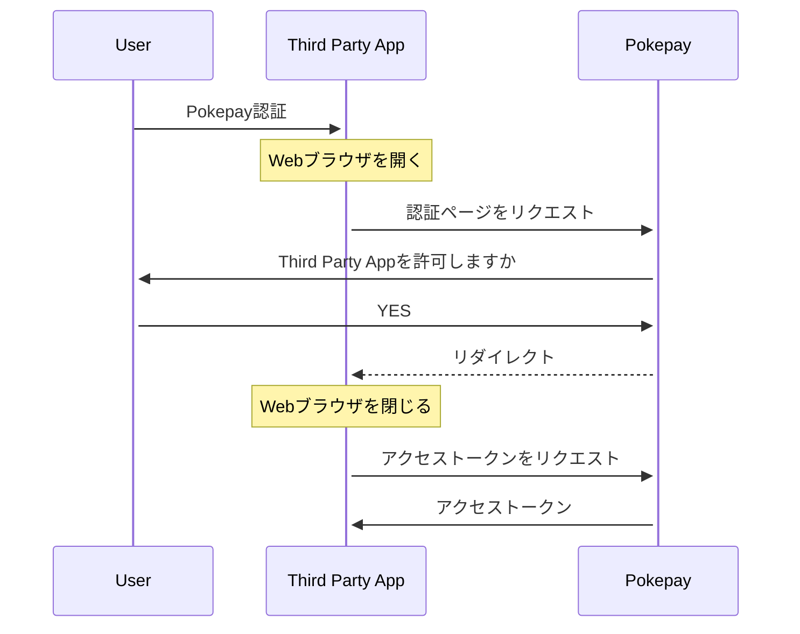

# Pokepay Swift SDK

## Overview

これは [Pokepay](https://pay.pocket-change.jp) の決済プラットフォームをSwiftアプリケーションに組み込むためのSDKです。

このSDKは抽象度によって二段階に分離できます。

### Client API

1つはQRやNFCを使ってPokepayでの支払い・残高チャージを抽象化したClient APIです。QRで読み取った文字列を関数に渡すだけでQRの種類判別とAPIに対してのHTTPリクエストまでを一括して行います。

たとえば、支払い用のQRコードの文字列は `"https://www.pokepay.jp/cashtrays/dc204118-9e3b-493c-b396-b9259ce28663"` のようなものが入っています。

これを使って支払いを完了するにはこの文字列を `scanToken` を呼び出します。

```swift
let client = Pokepay.Client(accessToken: "ZhwMsfoAyWZMGrCAKrrofmwYHV82GkUcf3kYSZYYf1oDKVvFAPIKuefyQoc1KDVr")

// Scan a QR code
client.scanToken("https://www.pokepay.jp/cashtrays/dc204118-9e3b-493c-b396-b9259ce28663") { result in              
    switch result {                                                                                                   
    case .success(let transaction):                                                                                    
        print(transaction)                                                                                            
    case. failure(let error):                                                                                          
        print(error)                                                                                                  
    }                                                                                                                  
}
```

レスポンスとして `transaction` が返ってきます。これは以下のような構造体になっています。

```swift
// 例) 194円の支払い取引のレスポンス
UserTransaction(
    id: "1e53ba8f-d755-4d84-8698-79a5b0dd3615",
    user: Pokepay.User(
        id: "4abed0cc-6431-446f-aaf5-bebc208d84c1",
        name: "上川口屋",
        isMerchant: true
    ),
    balance: 1080.0,
    amount: -194.0,
    moneyAmount: -194.0,
    pointAmount: 0.0,
    description: "うまい棒18本を購入",
    doneAt: "2018-07-08T14:29:00Z"
)
```

この関数 `scanToken` は個人間送金、硬貨チャージ機でのチャージ、ポケレジでの決済の各QRコードをSDK側で自動判別して処理を行うため、アプリケーションで意識する必要はありません。

### Low-Level API

もう1つは、Pokepayの決済Web API (BankAPI) に対してリクエストを行うLow-Level APIです。Pokepayが提供する決済用Web APIのエンドポイントをすべて呼び出すことができます。

```swift
import Pokepay

let client = Pokepay.Client(accessToken: "ZhwMsfoAyWZMGrCAKrrofmwYHV82GkUcf3kYSZYYf1oDKVvFAPIKuefyQoc1KDVr")
client.send(BankAPI.Terminal.Get()) { result in                                                                       
    switch result {                                                                                                   
    case .success(let terminal):                                                                                      
        print(terminal)                                                                                               
    case .failure(let error):
        print(error)
    }
}
```

## 認証

SDKからPokepayへのリクエストを行うには各ユーザーの情報にアクセスするためのアクセストークンを取得する必要があります。

PokepayではOAuthによりサードパーティが提供するアプリケーションの認証を安全に行います。

### OAuthでの認証の流れ



#### 1. Webブラウザで認証ページを開く

ユーザーのアクセストークンを取得するためにはユーザーに許可を得る必要があります。この操作はWebブラウザで行うため、アプリケーションからWebブラウザでPokepayのOAuth認証ページを開く必要があります。

この認証ページのURLは `Pokepay.OAuthClient.getAuthorizationUrl` で取得できます。

```swift
let oauth = Pokepay.OAuthClient(clientId: clientId, clientSecret: clientSecret)
let url = oauth.getAuthorizationUrl()
// => https://www.pokepay.jp/oauth/authorize?client_id=xxxxxxxxxxx&response_type=code
```

iOSの場合、SafariなどのWebブラウザアプリケーション、または `WKWebView` などのインアプリWebビューで開くことを想定しています。

#### 2. ユーザーがPokepayで認証するのを待つ

Webブラウザ上でユーザーがPokepayの認証を行い、アプリケーションを認可する操作を待ちます。認可が終わるとアプリケーションへリダイレクトされます。

#### 3. 認証コードを受け取る

処理が終わるとアプリケーションへリダイレクトされて戻ってきます。OAuthクライアントによってリダイレクトされるURLは異なりますが、たとえば `pp-oauth-app://oauth-callback?code=xxxxxxxxxxxx` のようにカスタムスキーマによってリダイレクトされます。

認証コードはクエリパラメーターとして付属しているので、URLをパースして `code` を取得します。

#### 4. アクセストークンを取得する

認証コードを使ってPokepayのAPIからアクセストークンを取得することができます。

```swift
let token = oauth.getToken(code: code)
token.accessToken // => "ZhwMsfoAyWZMGrCAKrrofmwYHV82GkUcf3kYSZYYf1oDKVvFAPIKuefyQoc1KDVr"
```

このアクセストークンはキーチェーンなど安全な場所に保管してください。

## Client APIリファレンス

### [Class] Pokepay.Client

#### オプション

- `accessToken` (String): 各ユーザーがPokepayへのリクエストを行うためのアクセストークンです。OAuth認証によって取得できます。
- `isMerchant` (Bool): 加盟店かどうかのフラグです。通常は `false` です。

### [Method] Client.getTerminalInfo

自身の端末情報を取得するメソッドです。返り値は以下のような構造体です。

```swift
Terminal(
    id: "45046d7f-aa33-4d26-8cb0-8971aae5a487",
    name: "",
    hardwareId: "4e5c5d18-b27f-4b32-a0e0-e8900686fe23",
    pushService: "apns",
    pushToken: nil,
    user: Pokepay.User(
        id: "9e3d0591-ab2c-47e5-8a8c-87533a54e8a8",
        name: "Pokepay太郎",
        isMerchant: true
    ),
    account: Pokepay.Account(
        id: "1b4533c0-651c-4e79-8444-346419b18c77",
        name: "",
        balance: 1080.0,
        isSuspended: false,
        privateMoney: Pokepay.PrivateMoney(
            id: "090bf006-7450-4ed9-8da1-977ea3ff332c", 
            name: "PocketBank",
            organization: Pokepay.Organization(
                code: "pocketchange",
                name: "ポケットチェンジ"
            ),
            maxBalance: 30000.0,
            expirationType: "static"
        )
    )
)
```

ユーザー情報やウォレット情報が含まれます。

たとえば、ユーザーの残高を取得したい場合は `terminal.account.balance` を参照します。

### [Method] Client.scanToken(_ token: String, amount: Double? = nil)

「取引トークン」を使って取引を行うメソッドです。取引トークンはQRコードをカメラでスキャンしたり、Bluetoothなどで送られてきます。

`amount` を指定すると任意の金額を受け取ることができます。たとえばチャージ時に1000円のうち500円など、部分的に受け取りたいなどというときに使います。支払いのときは指定できません。指定しなければ全額を対象に取引を行います。

例)

```swift
client.scanToken("https://www.pokepay.jp/cashtrays/dc204118-9e3b-493c-b396-b9259ce28663") { result in              
    switch result {                                                                                                   
    case .success(let transaction):                                                                                    
        print(transaction)                                                                                            
    case. failure(let error):                                                                                          
        print(error)                                                                                                  
    }                                                                                                                  
}
```

### [Method] Client.createToken(_ amount: Double? = nil, description: String? = nil, expiresIn: Int32? = nil)

新しい取引トークンを作ります。作った取引トークンをQRコードなどで表示すると、他のPokepayユーザーが読み取って取引を行うことができます。

例)

```swift
// 108円の送金用のトークンを作る
client.createToken(108) { result in
    switch result {
    case .success(let token):
        print(token)  // like 'https://www.pokepay.jp/checks/dc204118-9e3b-493c-b396-b9259ce28663'
    case .failure(let error):
        print(error)
    }
}
```
